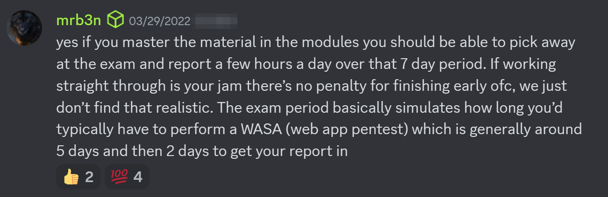
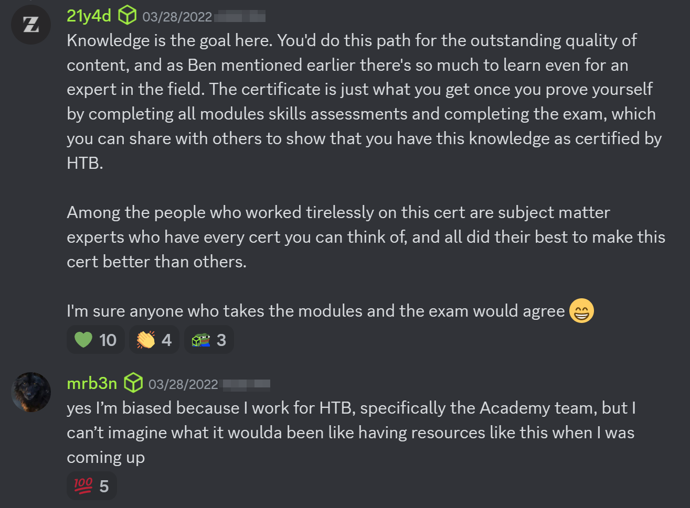

Preparing for the Certified Web Exploitation Specialist aka the *CWES* from HacktheBox? Here's my review along with some tips and tricks. I took the exam in July of 2024, being one of the first 600 or so candidates to successfully pass. 

>[!TIP] This certification was formerly known as the 'CBBH' or Certified Bug Bounty Hunter.

### Exam format
- Fully hands-on, zero multiple choice questions
- Requires 100% completion of the HTB academy [web penetration tester path.](https://academy.hackthebox.com/path/preview/web-penetration-tester)
- Black box environment
- Zero limitations on tools. 
- 7 days total to complete all exam requirements. Including:
	- A professional report.
	- A minimum number of flags (or a score of 80/100).
- You receive 2 exam attempts per voucher.
- You can reference the academy modules at anytime during the exam.
- The exam is aimed at beginners with little or no prior experience. If you've never done a hands-on 'hacking' exam, I'd highly recommend this be your first. Honestly I wish I did it BEFORE I did the CPTS, but oh well. I'll explain more on this later.

### Preparing

Completing the bug bounty path is a prerequisite for the exam. Some may finish in 4-6 weeks, others may take a few months. It just depends on how much free time you have, so don't worry about how long it takes you. Instead, focus on having a *solid understanding of the course material*. I previously completed the CPTS exam (see that review [here](https://cyberskies.net/blog/cpts/)) so I completed the remaining ~50% of the modules in a few weeks. Here are all 20 modules you need to complete. 

For those looking to do extra practice or don't feel quite ready to sit for the exam, I'd say go through the course material again. The exam is pretty realistic and everything is directly from the course modules. Going outside the course is a very slippery slope. Because of that, I'm not going to recommend any 'outside' boxes.

>[!TIP] If you feel you need more practice, redo parts of the course.

AND if you *reaaally* want some additional resources, read the above tip again, seriously, you don't need outside coursework. I'm not going to link anything because I'd like to emphasize that you should be sticking very close to the bug bounty path material, the other stuff isn't necessary. The course material is very good, and it's all you need to pass the exam. 

### My exam tips

- This is not a pentest exam.   
	You don't need to go rooting boxes and lateraling networks. You just need to find the 'cracks' in the armor. 
- Enumerate. Enumerate. Enumerate.   
	If it feels like your missing something... enumerate more.  
- Everything is in the course work.  
	Ease off the GoogleFu... Reference your course material.
- Utilize your cheatsheets and notes from Academy. Having commands ready to copy/paste will save you a ton of time.   
- Don't overthink it... [KISS](https://cyberskies.org/blog/kiss/). 

### My thoughts

The bug bounty path ties in nicely with the Certified Penetration Testing Specialist (CPTS) exam since completing the bug bounty path also completes ~50% of the pentest path. I think those looking to progress to the significantly harder CPTS will enjoy the web focused CBBH to get a feel for how how they perform on a 7 day exam, and how Hack The Box styles their exams. While the CPTS material is much different, beginners will benefit from learning the basics of web hacking. Web hacking is also a great place to start for those who don't have a specific niche they want to work in.     
Also... the exam is pretty fun. It somehow hits the perfect balance of difficulty and exploits. 

The exam is a great first step for beginners since it is not as 'time intensive' as many other exams (like CPTS). For CPTS I actually recommend taking as many days off as possible. In fact `mrb3n` from HackTheBox says the CWES is doable in a few hours a day. Granted you have firm grasp of the modules, I would agree with this. I managed to get most of the flags in a weekend, and because of this, I was able to relax and only work a few hours a day during the week (while still working full time).  

I think `21y4d` and `mrb3n` from HackTheBox summarize things well here.  

### Resources

For those interested in other offensive cybersecurity certs, you may be interested in my in-depth [CPTS](https://cyberskies.org/blog/cpts/) review.   

The HackTheBox Discord is a helpful place to be for all things HTB.   
[https://discord.com/invite/hackthebox](https://discord.com/invite/hackthebox)

  