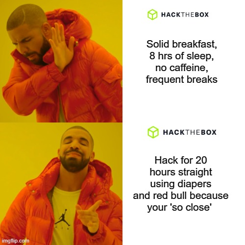

# Preparing for Hack The Box's CPTS    

> [!SUCCESS]  Updated for 2026!
## Overview

I was one of the first of about 400 or so individuals to successfully pass the Certified Penetration Testing Specialist or CPTS from Hackthebox (as of January 2024). Since then the exam has exploded in popularity! This is my experience with the exam, and plenty of tips and tricks for those looking to take the exam. 

> [!WARNING] Without a doubt this exam will surpass the OSCP in terms of popularity and HR clout in a few short years.

## The Exam

- Fully hands-on, zero multiple choice questions.
- Requires 100% completion of the HTB academy [penetration testing job role path.](https://academy.hackthebox.com/path/preview/penetration-tester)
- Black box environment.
- Zero limitations on tools.
- 10 days total to complete all exam requirements. Including:
    - A professional penetration test report.
    - A minimum number of flags (or a score of 85/100).
- You receive 2 exam attempts per voucher.
- You can reference the academy modules at anytime during the exam.
- Since the exam is a black box test you’ll know very little about the exam environment before hitting the ‘start exam’ button. Once you do everything will be explained to you. This may feel uncomfortable to some but that’s totally normal! Trust yourself that you already have the skills and knowledge to succeed.

## Preparing

It can be tempting but beginners should NOT rush through the academy path. The academy modules will teach you everything you need for the exam, but the exam itself is no joke. If you think you can get away with using automated tools and copy/pasted commands, the exam will slap you in the face. 

You should feel very comfortable performing any and all of the exercises found inside the penetration testing path. If your struggling with a particular module, make sure to take some extra notes and make some cheat sheets. It's always that one thing you don't study that ALWAYS ends up being on the exam. Practicing the 'Attacking Enterprise Networks' module with a 2 day time limit and not using the module resources, is a pretty solid gauge of how ready you are for the test.

For reference it takes folks anywhere from 40 - 90+ days to complete the entire penetration testing job role path. Mostly it depends on how much time you can devote to the academy each day, I took around 4 months to complete it, averaging about 1 to 3 hours during the weekdays. I was in no rush to complete the path because I felt I learned something worthwhile from each of the modules. One of the biggest tips I'm going to stress over and over is `take amazing notes.` **Record all the commands you use inside the modules! Especially… especially the ones you aren’t familiar with.** I'll come back to note taking but lets move on for now. 

## My experience

This was my first 'hands-on' hacking exam. And well... I failed... my first attempt. I passed on my second attempt which means the exam took me 20 days and I ended up with a roughly 70 page report. Ironically, if you asked me how hard the exam was I would say it wasn’t any harder than a typical easy to medium box on the regular HTB platform. 

That being said the things I struggled with were things I did not anticipate. The exam is quite large and I wasted a lot of time exploring rabbit holes and looking at the same things over and over. To avoid this I suggest looking into something for 20-30 minutes, set a timer if you need to, and then move on if nothing new comes from it. On the other hand if you find yourself circling back to the same exact thing over and over, well you should probably investigate that thing.

I took the exam over a holiday break so I didn't have to worry about balancing work and the exam. I knew I was going to go 150% to try and pass the damn thing. Well true to form, I went hard. Real hard. Burn-out is a real thing and do NOT recommend.



I'd tell you not to do it this way but you'll probably ignore me. So... know yourself. If you are you one of those people (like myself) who turns on their ‘get-it-done’ brain, make sure you take care of yourself. Meal prep, schedule outside time, exercise, follow a routine. I would also suggest coordinating a few days off from your regular job to focus solely on the exam. I do not see most beginners passing by working on the exam after already having worked 8 hours at a full time job.   

One thing I wish I practiced more prior to the exam was my methodology. I was not very organized in my approach to finding vulnerabilities. What am I going to look at first? What are my priorities? How about after that? Okay what if I can't find anything? Having a general strategy and plan of attack helps you not panic under pressure. I can't say much else since I don't want to spoil anything but make sure your notes are well organized before starting the exam. Your notes taken during the live exam are also just as important as the notes you prepared beforehand.    

> [!TIP] Step by step exploit notes
> If you have to reset the exam or retake the exam your notes will be crucial  for catching back up to your previous state. Well organized notes will also make your final report writing go MUCH faster. Remember the more time you spend on the report, the less time you will have in the environment. 

For note taking I used Obsidian but come exam time you should have your own favorite note taking app well established (CherryTree, Joplin, ~~onenote~~). During my first attempt I used a full day to write a nice detailed report, so finishing the rest of the report in the second week was a breeze. Once again if you `take good notes` throughout the exam, you will cut your reporting time down significantly.

The length of the report does not really matter so don't worry about it. You just need to include all the [major aspects of a penetration test report](https://www.hackthebox.com/blog/penetration-testing-reports-template-and-guide#how_to_write_impressive_penetration_testing_reports_) (this is covered in the reporting module). 

HTB also offers Sysreptor, a pretty cool reporting tool for this, as well as a regular Word document template. What reporting tool you use is totally up to you. If you plan on using Sysreptor, make sure to know how it works BEFORE the exam. As a rule of thumb you never want to use a tool for the first time when in a live environment.  

> [!WARNING] Hand-in a report regardless of how absolute dogwater it is. 

Handing in a report enables you to get your extra exam attempt, and also allows you to get feedback from the grading team (and maybe, just maybe... a nudge). 

If you failed, one big reason to hand-in a semi-decent report instead of that hot garbage you made in 10 minutes on chatgpt is so you don't miss out on valuable feedback directly from the graders. After my first attempt I got some solid feedback with how to improve. My initial results came back super quick in about two days. My passing attempt results came back in about 2 weeks, during which time I was dying to find out, but pretty confident I passed. Surprisingly I never received any feedback or emails, but I did find my certification waiting for me inside my account!!  

**Side note:** *I do believe you're supposed to get feedback on both attempts and a congratulations email(?) I’m not sure what happened there.*

### My background

Prior to taking the exam I had completed many 'multiple choice certifications' like CompTIA's Pentest+, CASP+, and Security+. Did they help me at all for the exam? Sorta. Everything is a building block and none of it was wasted time. Everyone has to start somewhere and all of your prior knowledge will act as small steps towards your future goals. I should also mention the military paid for all of my previous certifications, so... thanks Uncle Sam. **One of the best parts of the CPTS** is that it's very realistic and designed to include everything you need. The pentest job role path will teach you everything you need to know for the exam. One caveat to this is that knowing the basics like networking, RDP, SSH, Active Directory, Linux and DNS will make the academy lessons go much smoother. The less you know the longer the academy path will take you.  

If you're a complete newbie I'd honestly recommend starting with the [CWE](https://academy.hackthebox.com/preview/certifications/htb-certified-web-exploitation-expert) before attempting CPTS. It's web focused, much smaller and significantly easier! The academy path also overlaps with CPTS, meaning completing the CBBH path will complete ~50% of the CPTS path and vice versa. The overlap is convenient if you end up doing both certs. Considering the price points of both certifications compared to the competition (OffSec) it's a really great deal. 

### My thoughts

Overall, I found the exam to be challenging but accurately calibrated for beginners. It was tough but yet realistic and attainable. There were no crazy hidden secrets or 'gotcha' flags... although some flags were harder than others. I think HTB did a great job with both the course and the exam. I fully recommend it for individuals looking to take their first hands-on hacking certification. Honestly once you do a true 'hands-on' exam, you'll probably realize how much of a joke exams like the Certified Ethical hacker (CEH) are.  

I have no doubt HacktheBox certifications will grow in popularity over the next few years. Currently the CPTS is overshadowed by other certifications like the OSCP, but considering the all the quality content HTB is currently releasing, I think this is changing. Although I do wonder how HTB will combat cheating.

My only real complaint was that some of the academy module questions were oddly worded and it was hard to tell exactly what they were looking for. Also there is no search feature for HTB Enterprise users, so if you need to check a reference, you have to manually look through all of the academy modules. 

> [!SUMMARY] *OSCP vs CPTS?* Check out Will and PinkDraconian videos (links below).

**TL;DR** the quality of CPTS materials wins hands down. If your resume isn't making it past HR, there are probably other issues to look at. Take CPTS first, then take OSCP when you're not the one paying for it.

## On note taking

Working in a the same environment for over a week can be tough. Chances are on day 10 you’ll forget everything you did on day 1. And if  you are saving your reporting until the end? Forget it... your brain might be a potato. Keeping your notes detailed and organized will prevent the dreaded day 7 potato brain.

Example of a garbage note:

```bash
# I used Mimikatz to escalate from user to root:
# Then:
cat flag9.txt
HTB{FLAG9}
```

Umm...
- What IP and hostname is this on? 
- Who is the user? 
- What was the syntax? 

This note generates more questions than it answers!

You may get distracted and fall into rabbit holes, you may take a significant amount of notes on paths that do not end up working. These things are totally normal, but be mindful of how your notes are progressing and if they make sense.  

Here's a few pointers for taking better notes:

- Before you figure out the correct path to the flag, you'll be throwing things at the wall to see what sticks... Do yourself a favor and separate your notes into sections. One way to do this is to have a 'scratch pad' section and a 'walk through' section. Your 'scratch pad' will be temporary notes to find what works and what doesn't. Your 'walk through' will be your finalized path to the flag. The walk through will include the exact steps you took to get to the flag. You should be able to easily copy/paste these commands into your terminal to regain access. In general you should keep your walk-through very organized and include things like:
1. IP + Hostname
2. Specific vulnerability you found
3. Exact commands to get to the flag (in the correct sequence)
4. File paths / locations of key findings.

You can use the above technique with your screenshots as well. Not sure if something's important? Take some screenshots and place them in a separate 'investigations' folder. Remember you do not have to include every single screenshot in your final report... In fact you shouldn't because who the heck wants to look at 300 pages of screenshots. Keep it efficient. Having all these commands and screenshots ready to go for the report will make it go much quicker. 10 days seems like a lot of time but it goes quickly!

## Practice
A lot of students wonder what else they can do to practice before taking the exam. Honestly there isn't a ton...  #justsendit The best practice for the exam is... well... the exam (remember you get two attempts).

I've done a few pro labs including Dante and Zephyr, and I don't particularly recommend them as extra practice. You'll want to stick to the academy topics pretty closely. If you have zero active directory experience I'd recommend Zephyr but it's not necessary. The Bloodhound academy module may also be beneficial (this one isn't on the Pentest path). 

Ranking up on the HTB platform or solving older boxes can be helpful to get some practice dialing-in your methodology and note taking. I'd say you should feel comfortable solving any easy level box, especially those involving Active directory or basic Windows/Linux privilege escalation. 

HTB academy recommends specific boxes if look inside the academy modules. Personally I would use these recommendations if you need extra practice. If you can solve 1 box a day for 10 days you should be all set to take on the exam. 

Good luck and **Happy Hacking!!** 💻 

---  

## Resources   
  
- [Will Moody’s CPTS video review](https://www.youtube.com/watch?v=dRW1Gxmu__Q) : Great tips and tricks. Definitely worth the watch before sitting for the exam. I believe Will has the record for the fastest passing exam (5 days) which is bananas. 
-  [Ippsec Walkthroughs](https://www.youtube.com/channel/UCa6eh7gCkpPo5XXUDfygQQA) : Amazing free resource to see how a pro works through a box. It's also hilarious/refreshing to see him stumble. If you don't have a mentor, you need to be watching **watch Ippsec's videos.** 
- [OSCP v CPTS with PinkDraconian](https://www.youtube.com/watch?v=-5s2R0Mldgw) : Detailed breakdown of OSCP vs CPTS (Spoiler: CPTS is miles better but much harder)
-  [Official HTB details](https://academy.hackthebox.com/preview/certifications/htb-certified-penetration-testing-specialist) : Official Cert info.
- [Hackthebox Forums](https://forum.hackthebox.com/) : Official Forums! Chances are any academy question you may have has already been answered here.
- [Hackthebox Official Discord](https://discord.com/invite/hackthebox) : Highly recommended to join if you're working through the academy paths. Most people are very willing to help out. 

**On Discord and the hacking community:** *You're toughest critic is yourself. Reach out to people, don't be afraid to ask for help. Just be specific: [On Asking Questions](https://dontasktoask.com)* 
- The [video every beginner should watch](https://www.youtube.com/watch?v=0Ejj2aBG5c8) 

  