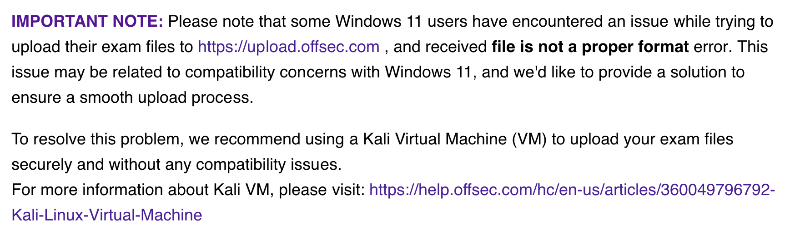

For as long as I can remember, certifications from Offensive Security (OffSec) have carried an almost mythical aura. OSCP? That will get you a job interview. OSCE3? A guaranteed raise. They are legendary, intimidating, and undeniably respected. Paying nearly $2,000 (USD) for a certification also tends to scare away those who aren't serious about the journey. Especially since additional exam attempts mean an additional investment of both time and money. So when my company offered me a prepaid OffSec license, I jumped at the opportunity. The only catch was that I had a 60 day time limit.  

My experience was NOT at all what I expected and honestly... I am not very impressed OffSec. 

## Preparing

Since I only had 60 days to take an exam of my choosing, I 'skimmed' the course. I spent the majority of my time doing the labs and referenced the course material as needed. I ended up completing the majority of some of the most recent labs, which made me feel pretty ready for the exam. Having a few HackTheBox certs (CPTS + CWES) also boosted my confidence. Although the strict rules, 48-hour time limit, and being watched via webcam was definitely intimidating. I can easily see how those with test anxiety can panic under the pressure. 

## The course and labs

**Pros:**
- There are videos! Although they are very much AI generated and generic. I didn't find them super helpful but if you prefer watching over reading, then you're in luck.
- There are some good low level explanations explaining how exploits and evasion work 'under the hood.'
- The Discord is incredibly active and helpful. I found answers to the majority of my questions with the search feature. 

**Cons:**
- The course is in need of a refresh/update. 
- In my experience the labs were not the most reliable. They went down several times, or very easily broke during testing. 
- Kai AI is a rather pushy and bothersome. 
- Lacking some general 'quality of life' improvements that exist on other platforms. For example, if your VPN dies, it automatically shuts off your lab. And since there are no save points,  you'll have to start over. 

## Passing

I was pretty nervous about getting the entry point and first flag. Luckily after a few hours I got in, and things went pretty smoothly from there. It took about 2 weeks to find out I passed. With all the rules and an upload issue**, I wasn't exactly sure I passed when I submitted my report which made those two weeks very long!

> [!TIP] READ this multiple times before your exam: 
> https://help.offsec.com/hc/en-us/articles/360050293792-OSEP-Exam-Guide

**No seriously, go read the exam info.**   
Don't be like me and accidentally submit your report on Windows and then encounter issues.

## Thoughts

Firstly OffSec has incredibly strict confidentiality rules [viewable here](https://www.offsec.com/legal/terms-and-conditions/#Confidential%20Information:~:text=support%20we%20provide.-,Confidential%20Information,-Recipient%20and%20its) so I am not surprised their certs are still perceived as mythical. Yes, the exam is not for beginners because the concepts taught are not entry-level. You will need to study and feel confident in your test methodology, or else the pressure of the imposed time-limit will surely get to you. Personally I thought the CPTS exam by Hackthebox was tougher! and the CPTS isn't even marketed as an *advanced* cert!

I've worked with some incredibly talented testers who excel in real-world engagements, but then struggle when placed into an artificial, high-pressure time window. The clock does not always measure capability, sometimes it just measures how well someone performs under stress. 

The OSEP material itself didn't blow me away, it felt dated and I didn't walk away with many new tricks. Still, the certification ended up helping me secure a raise, so after 60-days of cramming and 48-hours of hacking, I was glad I took it.  

## My personal recommendations

I'll come right out and say it... Do not spend $2k of your own money on a cert if you are trying to break into the field. Don't do it. The days of "wow you have X cert, please take this job!" are over. Get an IT-related job, and then let your employer pay your cert bills. 

Personally I learned way more from other exams/courses like CRTO and CPTS. Overall I found the learning content from the other courses mentioned in my blog to be of higher quality, and a much lower cost.

For those planning to take an OffSec exam, good luck and stay focused! You got it. 
